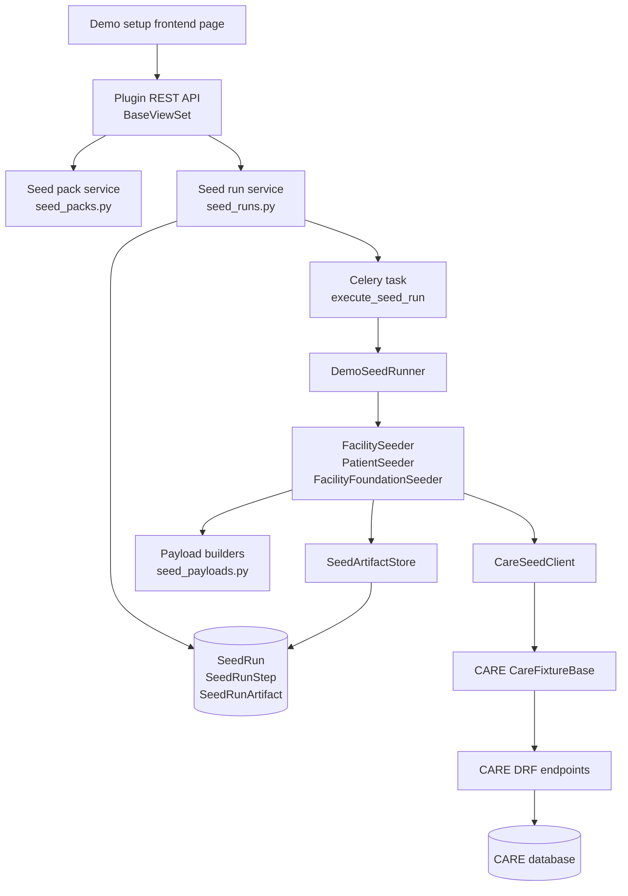

# Backend architecture

This page explains the current backend architecture of the `care_demo_facility_setup` plugin at a high level. If you want the exact method-by-method call chain, read [End-to-end backend flow](end-to-end-flow.md) and [File and method reference](file-and-method-reference.md).

## What this backend does

The plugin lets an authenticated CARE admin validate and execute a packaged demo setup. It does not create records directly through Django models for the clinical/facility resources. Instead, it uses CARE's existing fixture helper, `CareFixtureBase`, which calls CARE DRF endpoints. That keeps the demo setup aligned with CARE serializers, validation, permissions, side effects, and response formats.

At runtime it:

1. Exposes plugin endpoints under `/api/care_demo_facility_setup/`.
2. Loads packaged seed data from `seed_packs/generic_hospital_v1/`.
3. Validates the selected pack/profile against the current CARE host and database.
4. Creates a persistent `SeedRun` and planned `SeedRunStep` rows.
5. For real runs, enqueues a Celery task after the request transaction commits.
6. Executes the registry-defined seed steps in order (by default: facility, patients, facility foundation).
7. Stores every created/reused CARE resource as a `SeedRunArtifact`.
8. Lets the frontend poll run details until the run finishes.

## Runtime layers



## How CARE loads the plugin

CARE loads this plugin through the normal pluggable-app mechanism:

1. The CARE backend's `plug_config.py` defines a `Plug` with `name="care_demo_facility_setup"`.
2. `PlugManager.get_apps()` returns that name.
3. CARE settings add plugin names to `INSTALLED_APPS` through `PLUGIN_APPS`.
4. CARE `config/urls.py` includes each plugin URL module at `api/<plugin_name>/`.
5. Therefore, this plugin's `urls.py` is reachable under `/api/care_demo_facility_setup/`.

## API surface

| Endpoint | Method | Auth | Purpose | Main code path |
|---|---:|---|---|---|
| `/api/care_demo_facility_setup/health` | GET | No explicit viewset auth | Lightweight health check. | `urls.healthy()` |
| `/api/care_demo_facility_setup/hello/` | GET | Authenticated | Simple plugin smoke-test response. | `BaseViewSet.hello()` |
| `/api/care_demo_facility_setup/seed-packs/` | GET | Authenticated | List packaged seed packs. | `BaseViewSet.seed_packs()` → `list_seed_packs()` |
| `/api/care_demo_facility_setup/profiles/?pack_slug=...` | GET | Authenticated | List available profiles for a seed pack. | `BaseViewSet.profiles()` → `list_profiles()` |
| `/api/care_demo_facility_setup/validate/` | POST | Authenticated | Validate selected pack/profile without creating a run. | `BaseViewSet.validate()` → `validate_seed_request()` |
| `/api/care_demo_facility_setup/runs/` | GET | Authenticated | List latest seed runs. | `BaseViewSet.runs()` → `serialize_seed_run()` |
| `/api/care_demo_facility_setup/runs/` | POST | Superuser only | Create a dry run or enqueue a real run. | `BaseViewSet.runs()` → `create_seed_run()` → optional `enqueue_seed_run()` |
| `/api/care_demo_facility_setup/runs/<external_id>/` | GET | Authenticated | Fetch one run with steps and artifacts. | `BaseViewSet.run_detail()` → `serialize_seed_run(include_details=True)` |

## Why `CareSeedClient` exists

The current execution path is intentionally:

```text
DemoSeedRunner
→ seeder
→ CareSeedClient
→ CareFixtureBase
→ SeedAPIClient
→ CARE DRF endpoint
```

`CareFixtureBase` expects a DRF `APIClient` response with a `.data` attribute. During plugin/Celery execution, a plain internal request can hit Django redirects before DRF handles it. `SeedAPIClient` prevents two common redirect problems:

- It adds a trailing slash to internal request paths.
- It sends requests with `secure=True` to avoid HTTP-to-HTTPS redirects.

It also raises a diagnostic error if an internal call still does not return a DRF response.

## Persistent audit trail

The plugin creates an audit trail for every attempt:

- `SeedRun` stores the request, selected pack/profile, overall status, summary, error, and timestamps.
- `SeedRunStep` stores planned/executed step status, messages, stats, and timings.
- `SeedRunArtifact` stores the ref-to-created-resource mapping and the CARE API response payload.

This means the UI can show both progress and the final list of created resources without querying every CARE resource again.

## Current implementation boundaries

- Real execution requires a superuser requestor.
- Celery enqueueing happens with `transaction.on_commit(...)` so the worker sees the newly created `SeedRun` row.
- Dry runs do validation only. They do not enqueue Celery and do not create CARE resources.
- The `validating` status exists in the model enum but the current flow does not set it.
- Lab tests and inventory data are packaged and validated for presence as future resources, but the current runner does not create them.
- The `signals.py` patient hook currently contains only a placeholder `pass`.
