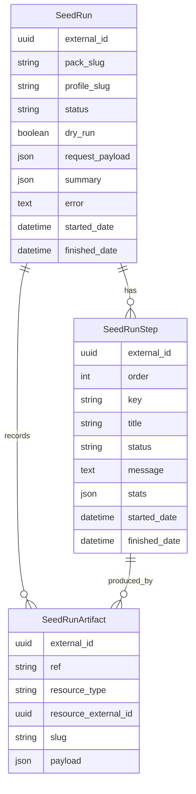

# Data model and seed packs

This page explains the persistent database objects, statuses, packaged JSON seed data, and validation rules used by the backend.

## Database model overview



All three models inherit CARE's `BaseModel`, so they also have the common CARE fields such as `id`, `external_id`, `created_date`, `modified_date`, and `deleted`.

## `SeedRun`

`SeedRun` is the parent record for one validation/dry-run/real-run attempt.

Important fields:

- `pack_slug` — selected seed pack, currently usually `generic_hospital_v1`.
- `profile_slug` — selected environment/profile, currently usually `local` for local development.
- `status` — overall lifecycle status.
- `dry_run` — true when the run validates only and does not create CARE resources.
- `requested_by` — authenticated user that requested the run; real execution requires this user to be a superuser.
- `request_payload` — raw API payload used to create the run.
- `summary` — validation summary returned by `validate_seed_request(...)`.
- `error` — validation or execution error text.
- `started_date` / `finished_date` — run timing.

## `SeedRunStatus`

| Status | Meaning in current code |
|---|---|
| `queued` | Validation passed for a real run and the Celery task should execute it. |
| `validating` | Defined in the enum but not currently set by the flow. |
| `running` | Celery worker has started `DemoSeedRunner.execute()`. |
| `succeeded` | Dry-run validation passed, or real execution finished successfully. |
| `failed` | Real execution failed or enqueueing failed. |
| `validation_failed` | Seed request failed validation before resource creation. |

## `SeedRunStep`

`SeedRunStep` records planned and executed phases within a run. The planned steps come from the seed step registry in `services/seed_step_registry.py`. `create_seed_run(...)` builds the step rows through `_planned_steps_for_pack(pack_slug)`, and `DemoSeedRunner.execute()` runs the executable steps by looping over `get_executable_seed_step_definitions(manifest)`. A seed pack manifest can override the step list with a `steps` key; otherwise `DEFAULT_STEP_KEYS` is used:

| Order | Key | Title | Who executes it? |
|---:|---|---|---|
| 1 | `validate` | Validate seed request | `create_seed_run(...)`; the runner does not re-run this step. |
| 2 | `facility` | Create demo facility | `DemoSeedRunner._execute_seed_step(...)` → `_seed_facility(...)` → `FacilitySeeder.seed(...)` |
| 3 | `patients` | Create demo patients | `DemoSeedRunner._execute_seed_step(...)` → `_seed_patients(...)` → `PatientSeeder.seed(...)` |
| 4 | `facility_foundation` | Create facility foundation | `DemoSeedRunner._execute_seed_step(...)` → `_seed_facility_foundation(...)` → `FacilityFoundationSeeder.seed(...)` |

## `SeedRunStepStatus`

| Status | Meaning |
|---|---|
| `pending` | Planned but not started yet. |
| `running` | Runner is executing this step now. |
| `succeeded` | Step completed successfully. |
| `failed` | Step failed with an error. |
| `skipped` | Step was intentionally not run, usually because of dry-run mode, validation failure, or an earlier failure. |

## `SeedRunArtifact`

`SeedRunArtifact` maps a stable seed ref to the actual CARE resource that was created or reused.

Examples:

| Ref | Resource type | Meaning |
|---|---|---|
| `facility:main` | `Facility` | The created demo facility. |
| `patient:001` | `Patient` | First created demo patient. |
| `department:administration` | `FacilityOrganization` | Reused auto-created Administration organization. |
| `location:first_floor_lab` | `FacilityLocation` | Created lab location. |
| `healthcare_service:laboratory` | `HealthcareService` | Created laboratory service. |

The artifact table is what lets later steps resolve earlier resources. For example, `FacilityFoundationSeeder.seed(...)` calls `SeedArtifactStore.external_id("facility:main")` before creating departments and locations.

## Seed pack layout

Packaged seed data lives under:

```text
src/care_demo_facility_setup/seed_packs/generic_hospital_v1/
```

| File | Purpose | Used by current runner? |
|---|---|---|
| `manifest.json` | Declares pack slug/name/version, resource file names, source CSV names, and expected counts. | Yes, for loading and validation summary. |
| `profiles/demo.json` | Default profile placeholder for demo environments. | Can be listed/loaded, but currently lacks `geo_organization_external_id`, so validation fails if selected. |
| `profiles/local.json` | Local development profile with allowed hosts and a concrete government organization UUID. | Yes. This is the practical current profile for local runs. |
| `profiles/teleicu.json` | Conservative TeleICU placeholder profile. | Can be listed/loaded, but currently lacks `geo_organization_external_id`, so validation fails if selected. |
| `facility.json` | Template for the one demo facility. | Yes. |
| `patients.json` | Ten patient templates plus phone-number template. | Yes. |
| `facility_foundation.json` | Departments, locations, and healthcare services. | Yes. |
| `lab_tests.json` | Lab activity/specimen/observation/charge definitions for later milestones. | Loaded and checked for presence only. Not created yet. |
| `inventory_items.json` | Product knowledge/inventory data for later milestones. | Loaded and checked for presence only. Not created yet. |
| `raw/*.json` | Raw CSV rows converted into JSON for traceability. | No runtime use in the current runner. |

## Validation rules

`validate_seed_request(...)` performs these checks before a run is allowed to execute:

### Pack and profile checks

- The seed pack directory must exist.
- `manifest.json` must exist and be valid JSON.
- The selected profile JSON must exist.
- The profile's own `slug` must match the requested `profile_slug`.

### Host/profile guardrail

- The backend derives the current host from `request.get_host()`.
- `_normalize_host(...)` normalizes hostnames and URLs.
- If the profile defines `allowed_hosts`, the current host must be included.
- If no host is available, validation adds a warning instead of an error.

### Geographic organization check

- The profile must define `geo_organization_external_id`.
- That UUID must match an existing CARE `Organization` with `org_type="govt"`.
- This organization id is passed into facility and patient creation.

### Facility checks

- `facility.json` must load as a JSON object.

### Patient checks

- `patients.json` must load as a JSON object with a `patients` list.
- If the manifest declares `counts.patients`, the list must contain exactly that many patient templates.
- If `count` is present in `patients.json`, it must equal the manifest `counts.patients`.

### Facility foundation checks

- `facility_foundation.json` must load as a JSON object.
- `departments` must be a list; if the manifest declares `counts.departments`, it must contain exactly that many entries.
- `locations` must be a list; if the manifest declares `counts.locations`, it must contain exactly that many entries.
- `healthcare_services` must be a list; if the manifest declares `counts.healthcare_services`, it must contain exactly that many entries.
- Every entry must define a non-empty unique `ref`.
- `department:administration` must exist and must have `reuse_existing: true` because CARE auto-creates it when the facility is created.
- Non-reused departments must use `org_type="dept"`.
- Every location must use `mode="kind"`.
- Location parent refs must appear before child locations in the file.
- A parent location cannot be an instance location.
- Healthcare service department/location refs must point to known department/location refs.

### Future data warnings

- Missing `lab_tests` adds a warning.
- Missing `inventory_items` adds a warning.
- These are warnings because those resources are not created by the current runner yet.

## Deterministic phone numbers

The payload builders avoid hardcoded real-looking phone numbers.

- `facility_phone_number(...)` generates one facility phone number from `SeedRun.id`.
- `patient_phone_number(...)` generates unique patient phone numbers from `SeedRun.id` and patient index.

This keeps demo runs reproducible while avoiding fixed personal contact data.
