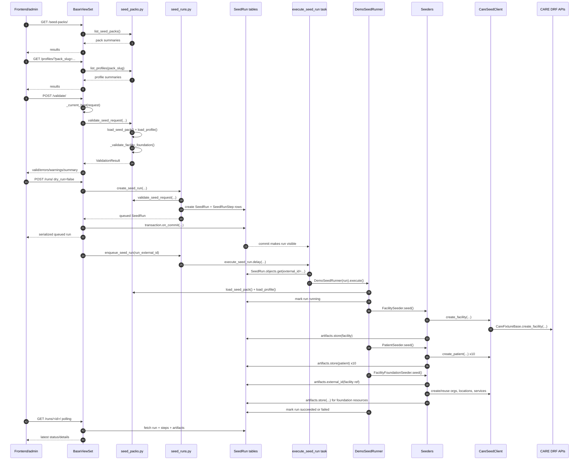

# End-to-end backend flow

This page follows the current backend from the first frontend/API request to the final `SeedRunArtifact` rows. Method names are written exactly as they appear in the code.

## Quick sequence diagram



## Page load flow

When the frontend page opens, it usually calls three read endpoints.

### 1. List seed packs

1. Frontend calls `GET /api/care_demo_facility_setup/seed-packs/`.
2. `BaseViewSet.seed_packs()` handles the request.
3. It calls `list_seed_packs()`.
4. `list_seed_packs()` scans `care_demo_facility_setup.seed_packs` package data for directories with `manifest.json`.
5. It returns a summary for each pack: slug, name, version, description, counts.

### 2. List profiles

1. Frontend calls `GET /api/care_demo_facility_setup/profiles/?pack_slug=generic_hospital_v1`.
2. `BaseViewSet.profiles()` reads the query param, defaulting to `DEFAULT_PACK_SLUG`.
3. It calls `list_profiles(pack_slug)`.
4. `list_profiles()` reads the pack manifest, locates the profiles directory, and returns profile summaries.
5. If the pack does not exist, `SeedPackError` is converted to HTTP 404.

### 3. List recent runs

1. Frontend calls `GET /api/care_demo_facility_setup/runs/`.
2. `BaseViewSet.runs()` sees the request method is `GET`.
3. It fetches the latest 50 runs with `prefetch_related("steps", "artifacts")`.
4. It calls `serialize_seed_run(run)` for each run.
5. It returns summaries without full step/artifact details.

## Validation-only flow

Validation does not create a `SeedRun`.

1. Frontend calls `POST /api/care_demo_facility_setup/validate/` with `pack_slug` and `profile_slug`.
2. `BaseViewSet.validate()` fills defaults:
   - `pack_slug`: `DEFAULT_PACK_SLUG` (`generic_hospital_v1`)
   - `profile_slug`: `demo`
3. It calls `_current_host(request)` to derive the current host from `request.get_host()`.
4. It calls `validate_seed_request(...)`.
5. `validate_seed_request(...)` calls:
   - `load_seed_pack(pack_slug)`
   - `load_profile(pack_slug, profile_slug)`
   - `_normalize_host(...)`
   - `_validate_facility_foundation(...)`
   - `_validate_seed_entries(...)`
6. It returns a `ValidationResult`.
7. `ValidationResult.to_dict()` becomes the response body.
8. The API returns HTTP 200 if `result.valid` is true, otherwise HTTP 400.

Validation checks are described in [Data model and seed packs](data-model-and-seed-packs.md#validation-rules).

## Dry-run creation flow

A dry run creates an auditable run record but does not create CARE resources.

1. Frontend calls `POST /api/care_demo_facility_setup/runs/` with `dry_run: true`.
2. `BaseViewSet.runs()` requires `request.user.is_superuser` for POST.
3. It calls `create_seed_run(...)`.
4. `create_seed_run(...)` validates the request with `validate_seed_request(...)`.
5. It creates a `SeedRun`:
   - `status = succeeded` if validation passes.
   - `status = validation_failed` if validation fails.
   - `started_date` and `finished_date` are set immediately.
6. It creates planned `SeedRunStep` rows from the seed step registry (via `_planned_steps_for_pack(pack_slug)`):
   - `validate` is `succeeded` or `failed`.
   - resource-creation steps are `skipped` for a valid dry run.
   - resource-creation steps are also `skipped` when validation failed.
7. Because the run is not `queued`, `BaseViewSet.runs()` does not enqueue Celery.
8. The API returns the serialized run with details.

## Real-run creation flow

A real run creates the same audit rows first, then executes asynchronously.

1. Frontend calls `POST /api/care_demo_facility_setup/runs/` with `dry_run: false`.
2. `BaseViewSet.runs()` checks that the caller is a superuser.
3. `create_seed_run(...)` validates the selected pack/profile.
4. If validation fails:
   - The run is saved with `status = validation_failed`.
   - The validation step is `failed`.
   - Creation steps are `skipped`.
   - The API returns HTTP 400 with the serialized run.
5. If validation passes:
   - The run is saved with `status = queued`.
   - The validation step is `succeeded`.
   - Creation steps remain `pending`.
6. `BaseViewSet.runs()` schedules `enqueue_seed_run(run_external_id)` inside `transaction.on_commit(...)`.
7. The API returns HTTP 201 with the queued run.
8. After the DB transaction commits, `enqueue_seed_run(...)` calls `execute_seed_run.delay(run_external_id)`.

The `transaction.on_commit(...)` step matters because CARE uses request transactions. Without it, Celery may try to fetch the run before the transaction makes the row visible.

## Celery execution flow

1. Celery calls `execute_seed_run(run_external_id)`.
2. The task fetches the `SeedRun` with `SeedRun.objects.get(external_id=run_external_id)`.
3. It creates `DemoSeedRunner(run)`.
4. `DemoSeedRunner.__init__()` loads:
   - the seed pack with `load_seed_pack(run.pack_slug)`
   - the profile with `load_profile(run.pack_slug, run.profile_slug)`
   - `geo_organization_external_id` from the profile
   - `CareSeedClient(run.requested_by)`
   - `SeedArtifactStore(run)`
5. `DemoSeedRunner.execute()` runs guard checks:
   - terminal runs are ignored (`succeeded`, `failed`, `validation_failed`)
   - dry runs cannot be executed
   - requestor must exist and be a superuser
6. It marks the run `running`.
7. It executes the three creation steps in order.

## Facility step flow

1. `DemoSeedRunner._execute_seed_step(...)` runs the `facility` step through the `_seed_facility` registry executor, fetching it with `_get_step("facility")`.
2. It marks the step `running` with `_mark_step(...)`.
3. It creates `FacilitySeeder(...)`.
4. `FacilitySeeder.seed(...)` calls `build_facility_payload(facility_template, run_id)`.
5. `build_facility_payload(...)`:
   - removes seed-only fields such as `ref`, `name_template`, and `description_template`
   - formats the facility name/description using the database `SeedRun.id`
   - calls `facility_phone_number(...)` if no phone number is already set
6. `FacilitySeeder.seed(...)` calls `CareSeedClient.create_facility(...)`.
7. `CareSeedClient.create_facility(...)` calls `CareFixtureBase.create_facility(...)`.
8. `CareFixtureBase` performs the actual CARE API request through `SeedAPIClient`.
9. The seeder stores the response with `SeedArtifactStore.store(...)`, usually under `facility:main`.
10. The runner marks the step `succeeded` with stats `{ "created": 1 }`.

## Patients step flow

1. `DemoSeedRunner._execute_seed_step(...)` runs the `patients` step through the `_seed_patients` registry executor, fetching it with `_get_step("patients")`.
2. It marks the step `running`.
3. It creates `PatientSeeder(...)`.
4. `PatientSeeder.seed(...)` loops over `patients_config["patients"]` with indexes starting at 1.
5. For each patient, it calls `build_patient_payload(...)`.
6. `build_patient_payload(...)`:
   - removes seed-only fields such as `ref`, `first_name`, and `last_name`
   - builds `name` from first/last name
   - calls `patient_phone_number(...)` if no phone number is already set
7. The seeder calls `CareSeedClient.create_patient(...)` for each payload.
8. It stores every patient response as a `SeedRunArtifact` using each template ref, such as `patient:001`.
9. The runner marks the step `succeeded` with stats like `{ "created": 10 }`.

## Facility foundation step flow

1. `DemoSeedRunner._execute_seed_step(...)` runs the `facility_foundation` step through the `_seed_facility_foundation` registry executor, fetching it with `_get_step("facility_foundation")`.
2. It marks the step `running`.
3. It creates `FacilityFoundationSeeder(...)`.
4. `FacilityFoundationSeeder.seed(...)` reads the created facility id by calling `SeedArtifactStore.external_id("facility:main")`.
5. It calls `_create_departments(...)`.
6. It calls `_create_locations(...)`.
7. It calls `_create_healthcare_services(...)`.
8. It returns a message and stats.
9. The runner marks the step `succeeded`.

### Department sub-flow

1. `_create_departments(...)` first calls `CareSeedClient.get_facility_organizations(facility_id)`.
2. For templates with `reuse_existing: true`, it calls `_find_facility_organization(...)` to find the auto-created organization by name.
3. For new departments, it builds a payload and calls `CareSeedClient.create_facility_organization(...)`.
4. Every reused/created department is stored as a `SeedRunArtifact` with resource type `FacilityOrganization`.
5. It returns a `department_ids` map from seed refs to CARE external ids.

### Location sub-flow

1. `_create_locations(...)` loops over location templates in seed order.
2. If a template has `parent_ref`, it resolves the parent from the already-created `location_ids` map.
3. It maps `organization_refs` to CARE organization ids from `department_ids`. If none are specified, it defaults to `department:administration`.
4. It sets safe defaults such as `status`, `operational_status`, `mode`, and `sort_index`.
5. It calls `CareSeedClient.create_location(...)`.
6. It stores the location artifact and records the location id.
7. It calls `CareSeedClient.add_organization_to_location(...)` for every linked organization.

### Healthcare service sub-flow

1. `_create_healthcare_services(...)` loops over service templates.
2. It resolves `managing_organization_ref` through `department_ids`.
3. It resolves `location_refs` through `location_ids`.
4. It calls `CareSeedClient.create_healthcare_service(facility_id, name, payload)`.
5. It stores each response as a `HealthcareService` artifact.

## Failure flow

If any seeder or CARE API call raises an exception:

1. The active step is marked `failed`.
2. The error message is truncated with `_safe_error(...)` to a maximum of 2000 characters.
3. `DemoSeedRunner.execute()` marks any still-pending steps as `skipped` using `_mark_pending_steps_skipped(...)`.
4. The overall run is marked `failed`.
5. The exception is re-raised so Celery can record task failure.

## Polling/detail flow

The frontend polls `GET /api/care_demo_facility_setup/runs/<id>/` while the run is `queued`, `running`, or `validating`.

1. `BaseViewSet.run_detail()` fetches the run by `external_id`.
2. It prefetches steps and artifacts.
3. It calls `serialize_seed_run(run, include_details=True)`.
4. The response includes request payload, steps, artifacts, timestamps, stats, and error text.# End-to-end backend flow

This document follows the backend from the first frontend/API request to the final created CARE resources.

## Short version

A user selects a seed pack/profile in the frontend and asks the backend to validate, dry-run, or create a demo facility.

For a real run, the backend flow is:

```text
Frontend
→ POST /api/care_demo_facility_setup/runs/
→ BaseViewSet.runs()
→ create_seed_run()
→ validate_seed_request()
→ SeedRun + SeedRunStep rows are saved
→ transaction.on_commit(enqueue_seed_run)
→ Celery execute_seed_run()
→ DemoSeedRunner.execute()
→ FacilitySeeder.seed()
→ PatientSeeder.seed()
→ FacilityFoundationSeeder.seed()
→ SeedRunArtifact rows are saved for every created/reused resource
→ SeedRun status becomes succeeded or failed
```

## Read/list flow

These calls populate the UI before a run is started.

### 1. List seed packs

```text
Frontend demoSetupApi.seedPacks
→ GET /api/care_demo_facility_setup/seed-packs/
→ BaseViewSet.seed_packs()
→ list_seed_packs()
→ importlib.resources reads seed_packs/*/manifest.json
→ Response { results: [...] }
```

Purpose: show available packaged seed packs and counts.

### 2. List profiles

```text
Frontend demoSetupApi.profiles
→ GET /api/care_demo_facility_setup/profiles/?pack_slug=generic_hospital_v1
→ BaseViewSet.profiles()
→ list_profiles(pack_slug)
→ manifest.json gives profiles_dir
→ profiles/*.json are read
→ Response { results: [...] }
```

Purpose: show allowed execution profiles for the selected seed pack.

### 3. List previous runs

```text
Frontend demoSetupApi.runs
→ GET /api/care_demo_facility_setup/runs/
→ BaseViewSet.runs()
→ SeedRun.objects.prefetch_related("steps", "artifacts").all()[:50]
→ serialize_seed_run(run)
→ Response { results: [...] }
```

Purpose: show recent audit history.

### 4. Poll run details

```text
Frontend demoSetupApi.runDetail
→ GET /api/care_demo_facility_setup/runs/{id}/
→ BaseViewSet.run_detail()
→ SeedRun.objects.prefetch_related("steps", "artifacts").get(external_id=id)
→ serialize_seed_run(run, include_details=True)
→ Response with request_payload, steps, artifacts
```

Purpose: show step progress and created resource artifacts. The frontend polls while status is `queued`, `running`, or `validating`.

## Validate-only flow

Validation checks the seed pack/profile/environment without creating a `SeedRun` row.

```text
Frontend demoSetupApi.validate
→ POST /api/care_demo_facility_setup/validate/
→ BaseViewSet.validate()
→ BaseViewSet._current_host(request)
→ validate_seed_request(pack_slug, profile_slug, care_base_url, current_host)
→ ValidationResult.to_dict()
→ HTTP 200 when valid, HTTP 400 when invalid
```

Inside `validate_seed_request()`:

1. `load_seed_pack(pack_slug)` loads `manifest.json` and resource JSON files listed in the manifest.
2. `load_profile(pack_slug, profile_slug)` loads `profiles/<profile_slug>.json`.
3. `_normalize_host()` normalizes the request host or supplied CARE base URL.
4. The normalized host is checked against `profile.allowed_hosts`.
5. `geo_organization_external_id` is required and must point to an existing government organization.
6. Facility, patient, and facility foundation JSON shapes are checked.
7. Counts are checked against the manifest `counts` (when declared):
   - `counts.patients` patient templates;
   - `counts.departments` departments;
   - `counts.locations` locations;
   - `counts.healthcare_services` healthcare services.
8. The foundation structure is checked:
   - `department:administration` must exist and use `reuse_existing`;
   - new departments must use `org_type='dept'`;
   - locations must use `mode='kind'`;
   - parent locations must be defined before children;
   - healthcare services must reference known department/location refs.
9. Warnings are added if future-milestone resource groups are missing.
10. A `ValidationResult` is returned.

## Dry-run creation flow

A dry run records validation and planned steps, but it does not enqueue Celery and does not create CARE resources.

```text
Frontend createDryRunMutation
→ POST /api/care_demo_facility_setup/runs/ with dry_run=true
→ BaseViewSet.runs()
→ superuser check
→ create_seed_run(...)
→ validate_seed_request(...)
→ SeedRun(status=succeeded, dry_run=true) if validation passed
→ SeedRunStep rows are created
→ non-validation steps are marked skipped
→ serialize_seed_run(include_details=True)
→ HTTP 201 when validation passed, HTTP 400 when validation failed
```

Dry-run statuses:

| Validation result | Run status | Validate step | Resource creation steps |
| --- | --- | --- | --- |
| Valid | `succeeded` | `succeeded` | `skipped` with dry-run message |
| Invalid | `validation_failed` | `failed` | `skipped` because validation failed |

## Real run creation flow

A real run validates first, creates database tracking rows, then schedules Celery after the database transaction commits.

```text
Frontend createRealRunMutation
→ POST /api/care_demo_facility_setup/runs/ with dry_run=false
→ BaseViewSet.runs()
→ superuser check
→ create_seed_run(...)
→ validate_seed_request(...)
→ SeedRun(status=queued) if validation passed
→ SeedRunStep rows are created
→ transaction.on_commit(lambda: enqueue_seed_run(run.external_id))
→ serialize_seed_run(include_details=True)
→ HTTP 201
```

`transaction.on_commit()` is important because CARE uses request transactions. Without waiting for commit, the Celery worker could try to load the `SeedRun` before the database row is visible.

## Celery execution flow

After the request transaction commits:

```text
enqueue_seed_run(run_external_id)
→ import execute_seed_run from tasks.py
→ execute_seed_run.delay(run_external_id)
```

The worker then runs:

```text
execute_seed_run(run_external_id)
→ SeedRun.objects.get(external_id=run_external_id)
→ DemoSeedRunner(run).execute()
```

## `DemoSeedRunner` startup

When `DemoSeedRunner(run)` is constructed:

```text
DemoSeedRunner.__init__()
→ load_seed_pack(run.pack_slug)
→ load_profile(run.pack_slug, run.profile_slug)
→ profile["geo_organization_external_id"] is stored
→ CareSeedClient(run.requested_by) is created
→ SeedArtifactStore(run) is created
```

Then `execute()` guards execution:

1. If the run is already terminal (`succeeded`, `failed`, `validation_failed`), return without doing anything.
2. If `dry_run=True`, raise `SeedRunExecutionError` because dry runs should never reach Celery.
3. If the requester is missing or not a superuser, raise `SeedRunExecutionError`.
4. Mark the run as `running`.
5. Execute the executable registry steps in order by looping `get_executable_seed_step_definitions(manifest)` and calling `_execute_seed_step(step_definition)` for each. By default this runs:
   - the `facility` step (`_seed_facility` → `FacilitySeeder`);
   - the `patients` step (`_seed_patients` → `PatientSeeder`);
   - the `facility_foundation` step (`_seed_facility_foundation` → `FacilityFoundationSeeder`).
6. If any step raises an exception:
   - mark remaining pending steps as `skipped`;
   - mark the run as `failed`;
   - re-raise the exception for Celery visibility.
7. If all steps succeed, mark the run as `succeeded`.

## Step 1: create facility

```text
DemoSeedRunner._execute_seed_step(facility step definition)
→ _get_step("facility")
→ _mark_step(step, running)
→ _seed_facility(runner, step)   # registry executor
→ FacilitySeeder(...).seed(step, facility_template)
→ build_facility_payload(facility_template, run.id)
→ CareSeedClient.create_facility(geo_organization, payload)
→ CareFixtureBase.create_facility(...)
→ SeedAPIClient.post(...)
→ CARE DRF facility endpoint
→ SeedArtifactStore.store(ref="facility:main", resource_type="Facility", payload=facility)
→ _mark_step(step, succeeded, stats={"created": 1})
```

The facility payload is generated from `facility.json`. The name and description are templated with the numeric `SeedRun.id`, and the phone number is generated deterministically from the run id.

## Step 2: create patients

```text
DemoSeedRunner._execute_seed_step(patients step definition)
→ _get_step("patients")
→ _mark_step(step, running)
→ _seed_patients(runner, step)   # registry executor
→ PatientSeeder(...).seed(step, patients_config)
→ for each patient template in patients.json:
    → build_patient_payload(patients_config, patient_template, index, run.id)
    → CareSeedClient.create_patient(geo_organization, payload)
    → CareFixtureBase.create_patient(...)
    → SeedAPIClient.post(...)
    → CARE DRF patient endpoint
    → SeedArtifactStore.store(ref="patient:00N", resource_type="Patient", payload=patient)
→ _mark_step(step, succeeded, stats={"created": 10})
```

Patient phone numbers are deterministic and include the run id plus patient index. This avoids hard-coded real-looking phone numbers in seed JSON.

## Step 3: create facility foundation

```text
DemoSeedRunner._execute_seed_step(facility_foundation step definition)
→ _get_step("facility_foundation")
→ _mark_step(step, running)
→ _seed_facility_foundation(runner, step)   # registry executor
→ FacilityFoundationSeeder(...).seed(step, facility_template, foundation)
→ SeedArtifactStore.external_id("facility:main")
→ _create_departments(...)
→ _create_locations(...)
→ _create_healthcare_services(...)
→ _mark_step(step, succeeded, stats={...})
```

### Department sub-flow

```text
_create_departments()
→ CareSeedClient.get_facility_organizations(facility_id)
→ for each department template:
    if reuse_existing:
      → _find_facility_organization(existing_organizations, name)
      → SeedArtifactStore.store(resource_type="FacilityOrganization")
    else:
      → build organization payload
      → CareSeedClient.create_facility_organization(facility_id, payload)
      → SeedArtifactStore.store(resource_type="FacilityOrganization")
→ return { department_ref: department_external_id }
```

`department:administration` is reused because CARE auto-creates the Administration organization when a facility is created.

### Location sub-flow

```text
_create_locations()
→ for each location template in order:
    → build location payload
    → resolve parent_ref from previously created location_ids
    → resolve organization_refs from department_ids
    → CareSeedClient.create_location(facility_id, payload)
    → SeedArtifactStore.store(resource_type="FacilityLocation")
    → for each organization id on the location:
        → CareSeedClient.add_organization_to_location(facility_id, location_id, organization_id)
→ return { location_ref: location_external_id }
```

Location order matters because child locations reference parents by refs that must already be created.

### Healthcare service sub-flow

```text
_create_healthcare_services()
→ for each service template:
    → build healthcare service payload
    → resolve managing_organization_ref from department_ids
    → resolve location_refs from location_ids
    → CareSeedClient.create_healthcare_service(facility_id, name, payload)
    → SeedArtifactStore.store(resource_type="HealthcareService")
```

## Failure flow

Failures are intentionally recorded in both the step and the run.

```text
Seeder or CARE API raises
→ DemoSeedRunner catches in the current _execute_*_step()
→ current step becomes failed
→ exception bubbles to DemoSeedRunner.execute()
→ pending steps become skipped
→ run becomes failed
→ error is truncated to 2000 characters
→ exception is re-raised for Celery logs
```

Common failure examples:

| Failure | Where it is detected |
| --- | --- |
| Invalid host/profile | `validate_seed_request()` |
| Missing government organization | `validate_seed_request()` |
| Missing `facility:main` artifact | `SeedArtifactStore.external_id()` |
| CARE response has no `id` | `SeedArtifactStore.payload_external_id()` |
| Internal request redirected instead of returning DRF response | `_ensure_drf_response()` |
| Auto-created Administration organization not found | `FacilityFoundationSeeder._create_departments()` |

## Final successful result

After a successful real run:

- `SeedRun.status = succeeded`;
- each planned step is `succeeded` except the validation step, which was already completed during run creation;
- artifacts exist for facility, patients, departments, locations, and healthcare services;
- the UI can display all created resources from `GET /api/care_demo_facility_setup/runs/{id}/`.
